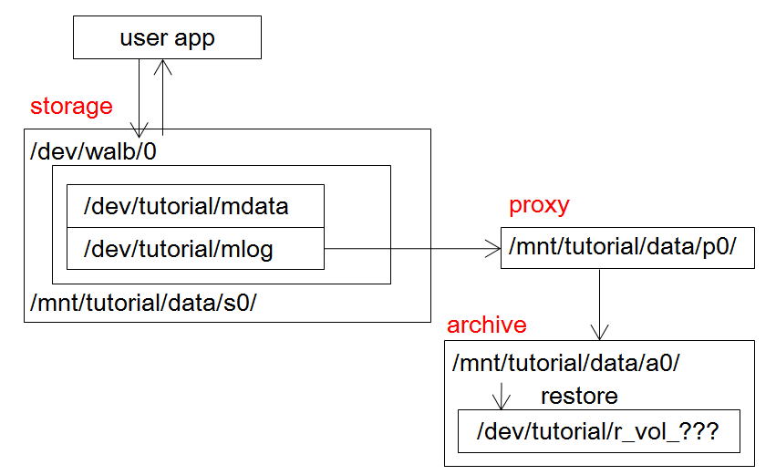
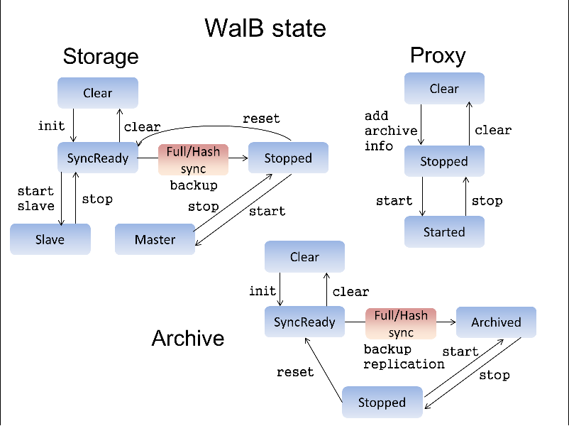

# WalB-tools チュートリアル

このチュートリアルは WalB-tools(以下 tools) の簡単な使い方を説明します。詳細は [README](README.md) を参照してください。

## WalB 概要

WalB 自体の概要は [WalB is hard](https://slideshare.net/herumi/walb-ishard/) を参照してください。

## 用語

詳しくは [用語一覧](word.md) - まだ作ってない - を参照。ここでは最小限の言葉を記す。

* **WalB ブロックデバイス (wdev)**: WalB デバイスドライバがユーザに見せるブロックデバイス。
ユーザはこの上にファイルシステムを作ったり、パーティションを切ったりしてデータを置く。
* **wlog**: wdev に write したときに生成されるログ情報。
通常ユーザが直接見ることはない。
* **wdiff**: wlog をユーザが見える形式に変換したもの。
* **WalB ログデバイス (ldev)**: wlog が実際に書き込まれるデバイス。
* **WalB データデバイス (ddev)**: wdev に write したデータが実際に書き込まれるデバイス。
WalB は ldev と ddev をセットにして一つのデバイス wdev に見せている。
ユーザが wdev を通して見えるデータ領域。
* **snapshot をとる**: wdev のある瞬間における状態に名前をつけること。
* **gid**: snapshot をとったときにつけられる名前(一意な64bit整数)。
* **restore**: ある snapshot を LVM のボリュームに復元すること。
* **merge**: 複数の wdiff をまとめること。内部的には重複の除去、圧縮、ソートが行われる。
* **apply**: フルイメージを保持する LVM のボリュームに古い wdiff を適用して削除すること。
古い snapshot は復元できなくなるが使用領域を減らすことが出来る。
* **storage**: wdevのあるサーバ。ldev から wlog を取り出して proxyに 転送する。
* **proxy**: storage から受け取った wlog を wdiff に変換して一時保存する。
wdiff は archive に転送される。
* **archive**: proxy から受け取った wdiff を貯蔵する。フルイメージも保持。
* **full-backup**: wdev の全データを storage から archive に転送し、フルイメージとして保存すること。
* **hash-backup**: 全 wdev をチェックして必要な差分データを storage から archive に転送すること。差分は wdiff として保存される。

## 最小構成

* PC 1台で walb-storage, walb-proxy, walb-archive を動かす。
  * これらは単なる exeなので デーモンとして起動するときは別途設定が必要。
  * walbc コマンドを使ってこれらのプロセスと通信し操作を行う。
  * 更に python/walblib/\_\_init\_\_.py を使うとより抽象度の高い操作ができる。
* サービス構成
  * s0(storage) : port 10000
  * p0(proxy) : port 10100
  * a0(archive) : port 10200
* ディスク構成
  * 新しくパーティションを切る場所がない、うっかり失敗してもいいようにループバックデバイスを使ってやってみる。
  * 全体像はこんな感じ 
    * wdev : /dev/walb/walb-tutorial-device
      * ddev : /dev/tutorial/mdata
      * ldev : /dev/tutorial/mlog
    * /mnt/tutorial/data/s0/ : storage サーバが管理するメータデータやログ情報を置く場所
    * /mnt/tutorial/data/p0/ : proxy サーバが管理するwdiffなどの情報を置く場所
    * /mnt/tutorial/data/a0/ : archive サーバが管理するwdiffなどの情報を置く場所
      * restore してできる LVM snapshot は /dev/tutorial/wr_vol_??? の形になる。

## VirtualBoxとVagrantによるテスト

* VirtualBoxとVagrantをインストールする
```
# Ubuntu16
sudo apt install -y virtualbox vagrant

# CentOS7
sudo yum install -y virtualbox vagrant
```

* ゲストOSのboxを取得する
```
# Ubuntu16
vagrant box add Ubuntu16 https://cloud-images.ubuntu.com/xenial/current/xenial-server-cloudimg-amd64-vagrant.box

# CentOS7
vagrant box add CentOS7 http://cloud.centos.org/centos/7/vagrant/x86_64/images/CentOS-7.box
```

* どちらかのOSを起動する
```
# Ubuntu16
cd walb-tools/misc/vagrant/Ubuntu16
vagrant up
vagrant reload

# CentOS7
cd walb-tools/misc/vagrant/CentOS7
vagrant up
vagrant reload
```

* sshで該当OSにログインしてWalBをセットアップする
```
vagrant ssh
```
```
sh setup.sh
```

[ipython での使用例](tutorial.ja.md#ipython-での使用例)に続く

## 手動インストール

* work ディレクトリの作成
```
> mkdir work
> cd work
> git clone git@github.com:walb-linux/walb-driver
> git clone git@github.com:walb-linux/walb-tools
```

* ドライバの build とインストール
  * kernel のバージョンに合わせてチェックアウトする。
    * kernel 3.13 なら
    ```
    git checkout -b for-3.10 origin/for-3.10
    cd module
    make
    sudo insmod walb-mod.ko
    ```

* walb-tools の build
  * clang++, gcc-4.8 以降の C++11 の機能を使う。
  * 各種ライブラリをインストールする。
  ```
  # Ubuntu16
  > sudo apt install -y linux-headers-`uname -r`
  > sudo apt install -y libaio-dev libsnappy-dev liblzma-dev zlib1g-dev
  
  # CentOS7
  > sudo yum install -y git gcc gcc-c++ kernel-devel snappy-devel xz-devel libaio-devel psmisc binutils-devel wget python-devel
  > wget https://bootstrap.pypa.io/get-pip.py
  > sudo python get-pip.py
  > sudo pip install jupyter
  > sudo pip install pylint
  ```

* build する。
```
> make -j 8 DEBUG=0 ENABLE_EXEC_PROTOCOL=1
```

* binsrc/ に各種 exe ができる。

## ディスクの準備

* ループパックデバイス用に 100MiB のファイルを作る。
```
> dd if=/dev/zero of=tutorial-disk bs=1M count=100
```

* /dev/loop0 に割り当てる。
```
> sudo losetup /dev/loop0 tutorial-disk
```

* 物理ボリュームを初期化する。
```
> sudo pvcreate /dev/loop0
> sudo pvs
> PV         VG   Fmt  Attr PSize   PFree
> /dev/loop0      lvm2 a--   100.00m  100.00m
```

* LV をいくつか作る。
```
> sudo vgcreate tutorial /dev/loop0
> sudo lvcreate -n wdata -L 10m tutorial
> sudo lvcreate -n wlog -L 10m tutorial
> sudo lvcreate -n data -L 20m tutorial
```

* /dev/tutorial/wdata と /dev/tutorial/wlog を合わせて wdev として扱う。
* /dev/tutorial/data を proxy, archive やシステムログ置き場にする。
```
> sudo mkfs.ext4 /dev/tutorial/data
> sudo mkdir -p /mnt/tutorial/data
> sudo mount /dev/tutorial/data /mnt/tutorial/data
> sudo mkdir -p /mnt/tutorial/data/{a0,p0,s0}
```

## サーバの起動

```
sudo binsrc/walb-storage -b /mnt/tutorial/data/s0/ -l /mnt/tutorial/data/s0.log -archive localhost:10200 -p 10000 -bg 1 -proxy localhost:10100 -fg 2 -id s0 -allow-exec &
sudo binsrc/walb-proxy -b /mnt/tutorial/data/p0/ -l /mnt/tutorial/data/p0.log -p 10100 -bg 1 -fg 2 -id p0 -allow-exec &
sudo binsrc/walb-archive -b /mnt/tutorial/data/a0/ -vg tutorial -l /mnt/tutorial/data/a0.log -p 10200 -fg 2 -id a0 -allow-exec &
```

## ipython での使用例

### stest/tutorial.py の読み込み

```
> cd walb-tools.git
> sudo ipython
> execfile('misc/tutorial.py')
```

内部状態などのパラメータはPython側では全く保持しておらず、全てサーバプロセス側で保持しているので、途中でipythonを終了させても、再び `execfile('misc/tutorial.py')` を実行すれば続きから再開することができます。

### WalB デバイスの初期化

1. /dev/tutorial/wlog の初期化: `wdev.format_ldev()`
2. WalB デバイス の作成: `wdev.create()`
* これで wdev.path (通常/dev/walb/walb-tutorial-device) ができる。
* /dev/walb/walb-tutorial-device が既に存在する場合`wdev.create()`が失敗するため、`sudo wdevc delete-wdev /dev/walb/walb-tutorial-device`を実行して削除する必要がある。

### ボリューム(VOL) の初期化

* `walbc.init_storage(s0, VOL, wdev.path)`
* 初期化に失敗する場合、後述の [状態の確認](tutorial.ja.md#状態の確認) を参考に strage, proxy, archive の全ての状態が Clear であることを確認し、 Clear でなかった場合は後述の [full-backup](tutorial.ja.md#full-backup) を参考に全ての状態を Clear にする必要がある。

### 状態の確認

* `walbc.get_state_all(VOL)`でそれぞれのサーバがどういう状態かわかる。
```
s0 localhost:10000 storage Standby
p0 localhost:10100 proxy Clear
a0 localhost:10200 archive Clear
```

### /dev/walb/walb-tutorial-device にファイルシステムの作成

* ipython をサスペンドして（あるいは別のプロンプトで）コマンドラインに戻り、ext4 で初期化する。
```
> sudo mkfs.ext4 /dev/walb/walb-tutorial-device
```

* mount する。
```
> sudo mkdir -p /mnt/tmp
> sudo mount /dev/walb/walb-tutorial-device /mnt/tmp
```
  * /mnt/tmp が walb 化されたファイルシステムである。

### full-backup

* ipythonに戻り、storage を SyncReady 状態にする。
  * どの状態からどの状態にいけるのか大まかな説明は  を参照。
  ```
  > walbc.stop(s0, VOL)
  ```

* フルバックアップを開始する。
```
> walbc.full_backup(s0, VOL)
```

* このコマンドにより、storage の wdev の全てのブロックを read してデータを archive に転送する。

### バックアップの復元

* /mnt/tmpに 適当にファイルを作る。 ***
* ファイルを完全にディスクに書き終わらすために umount する。
```
> sudo umount /dev/walb/walb-tutorial-device
```

* snapshot をとる。
```
> walbc.snapshot(s0, VOL, [a0])
> 8
```

* 表示された値がその snapshot に名付けられた gid。

* restore する。
```
> walbc.restore(a0, VOL, 8)
```

* できた LVM の snapshot は `get_restored_path` でわかる。
```
> walbc.get_restored_path(a0, VOL, 8)
> '/dev/tutorial/wr_vol_8'
```

* その snapshot の path を mount する。
```
> sudo mount /dev/tutorial/wr_vol_8 /mnt/tmp
```

* /mnt/tmp の中に *** で書いたファイルがあることを確認する。

* snapshot を削除する。
  * restore してできた LVM snapshot は `walbc.del_restored` で削除できる。
  * 対象となる LVM snapshot が mount されていると削除できないのでまず umount が必要。
  ```
  > walbc.del_restored(a0, VOL, 8) # mount したまま実行
  > 2014-11-12 07:03:56 ERROR Controller: error: c2aDelRestoredClient:child process has returned non-zero:1280
  > cmd:/sbin/lvremove
  > args:-f /dev/tutorial/wr_vol_8
  > stderr:  Logical volume tutorial/wr_vol_8 contains a filesystem in use.
  > umount /mnt/tmp
  > walbc.del_restored(a0, VOL, 8) # これで削除される
  ```

* restore した LVM snapshot一覧は `walbc.get_restored(a0, VOL)` で取得できる。

### merge

複数の wdiff を一つにまとめることができる場合がある。

以下のようなメリットがあるため、運用時には定期的に merge するとよい。

* メリット
  * 複数の wdiff は merge すると apply が速くなることがある。
  * 重複データが除去されるためデータサイズが小さくなることもある。

* wdiff を一覧表示
```
> walbc.print_diff_list(a0, VOL)
```
```
 '|0|-->|1| -- 2014-11-11T07:12:14 4120',
 '|1|-->|2| -- 2014-11-11T07:12:42 17221',
 '|2|-->|3| M- 2014-11-11T07:14:30 8445',
 '|3|-->|4| M- 2014-11-11T07:14:33 8216',
 '|4|-->|5| M- 2014-11-11T07:14:38 8732',
 '|5|-->|6| M- 2014-11-11T07:15:00 8488',
 '|6|-->|7| M- 2014-11-11T07:15:18 8649',
 '|7|-->|8| M- 2014-11-11T07:15:43 4120',
 '|8|-->|9| -- 2014-11-11T07:15:52 8496',
 '|9|-->|10| M- 2014-11-11T07:16:01 8542',
 '|10|-->|11| M- 2014-11-11T07:16:11 9278',
 '|11|-->|12| M- 2014-11-11T07:16:17 8876',
```
* `M` のマークがついた wdiff は merge できる。2から8までの wdiff を merge してみる。
```
> walbc.merge(a0, VOL, 2, 8)
> walbc.print_diff_list(a0, VOL)
 '|0|-->|1| -- 2014-11-11T07:12:14 4120',
 '|1|-->|2| -- 2014-11-11T07:12:42 17221',
 '|2|-->|8| M- 2014-11-11T07:15:43 5570',
 '|8|-->|9| -- 2014-11-11T07:15:52 8496',
 '|9|-->|10| M- 2014-11-11T07:16:01 8542',
 '|10|-->|11| M- 2014-11-11T07:16:11 9278',
 '|11|-->|12| M- 2014-11-11T07:16:17 8876',
```
  * 8445, 8216, 8732, 8488, 8649, 4120byte の wdiff が merge されて 5570byte の wdiff になったことを確認できる。

### apply

古い snapshot を restore する必要がなくなった場合、 wdiff を base image に適用することができる。

* メリット
  * 古い snapshot に必要な wdiff が削除されてディスク容量を減らすことができる。
  * restore にかかる時間も短縮できる。

* wdiff の一覧表示
```
> walbc.print_diff_list(a0, VOL)
['|0|-->|1| -- 2014-11-11T07:12:14 4120',
 '|1|-->|2| -- 2014-11-11T07:12:42 17221',
 '|2|-->|8| M- 2014-11-11T07:15:43 5570',
 '|8|-->|9| -- 2014-11-11T07:15:52 8496',
 '|9|-->|10| M- 2014-11-11T07:16:01 8542',
 '|10|-->|11| M- 2014-11-11T07:16:11 9278',
 '|11|-->|12| M- 2014-11-11T07:16:17 8876',
 ...
```
* 0～8までの wdiff を 0 に apply する。
```
> walbc.apply(a0, VOL, 8)
> walbc.print_diff_list(a0, VOL)
Out[11]:
['|8|-->|9| -- 2014-11-11T07:15:52 8496',
 '|9|-->|10| M- 2014-11-11T07:16:01 8542',
 '|10|-->|11| M- 2014-11-11T07:16:11 9278',
 '|11|-->|12| M- 2014-11-11T07:16:17 8876',
 ...
```
  * apply されて 0～8 の diff が削除された。

### ハッシュバックアップ

なんらかの障害で proxy サーバのデータが飛んだときなどに storage と archive の間で持っているデータの hash を比較して必要なものだけを転送する。

* メリット
  * フルバックアップに比べて転送データ量が少なくてすむ。

ハッシュバックアップを試してみる。

* storage を止める。
```
> walbc.get_state_all(VOL)
> s0 localhost:10000 storage Stopped
> p0 localhost:10100 proxy Started
> a0 localhost:10200 archive Archived
```

* この状態でハッシュバックアップを行う。
```
walbc.hash_backup(s0, VOL)
```

### レプリケーション

archive の非同期レプリケーションを行う。

* 最小構成にもう1個 archive サーバを加える。

* 追加する archive 用のディレクトリを作成する。
```
sudo mkdir /mnt/tutorial/data/a1
```

* tutorial.py の書き換え
  * 以下の diff を参考に tutorial.py を書き換える。
  ```
   a0_start = ServerStartupParam(a0_conn, binDir, dataPath('a0'), logPath('a0'), 'tutorial')
  
  +a1_conn  = ServerConnectionParam('a1', 'localhost', 10201, K_ARCHIVE)
  +a1_start = ServerStartupParam(a1_conn, binDir, dataPath('a1'), logPath('a1'), 'tutorial2')
  +
   a0 = a0_start
  +a1 = a1_start
  
  -sLayout = ServerLayout([s0], [p0], [a0])
  +sLayout = ServerLayout([s0], [p0], [a0, a1])
  ```
  * パッチファイルが用意されているため、次のようにそれを使用しても良い。
  ```
  cd walb-tools.git
  patch -p1 < misc/tutorial.patch
  ```

* ボリュームの追加
  * 新たに tutorial2-disk を作りそこに tutorial2 というボリュームグループを作る。
  ```
  dd if=/dev/zero of=tutorial2-disk bs=1M count=50
  sudo losetup /dev/loop1 tutorial2-disk
  sudo pvcreate /dev/loop1
  sudo vgcreate tutorial2 /dev/loop1
  ```

* サーバの停止
  * 次のステップで行うサーバの再起動の前段階として、既に起動してあるサーバを停止(kill)する。
  ```
  ps aux | grep walb
  ```
  ```
  root      1282  0.0  0.0  51420  3836 pts/1    S    13:44   0:00 sudo walb-storage -b /mnt/tutorial/data/s0/ -l /mnt/tutorial/data/s0.log -archive localhost:10200 -p 10000 -bg 1 -proxy localhost:10100 -fg 2 -id s0 -allow-exec
  root      1283  0.0  0.1 1219128 13396 pts/1   Sl   13:44   0:05 walb-storage -b /mnt/tutorial/data/s0/ -l /mnt/tutorial/data/s0.log -archive localhost:10200 -p 10000 -bg 1 -proxy localhost:10100 -fg 2 -id s0 -allow-exec
  root      1299  0.0  0.0  51420  3844 pts/1    S    13:45   0:00 sudo walb-proxy -b /mnt/tutorial/data/p0/ -l /mnt/tutorial/data/p0.log -p 10100 -bg 1 -fg 2 -id p0 -allow-exec
  root      1300  0.0  0.0 985824  4776 pts/1    Sl   13:45   0:04 walb-proxy -b /mnt/tutorial/data/p0/ -l /mnt/tutorial/data/p0.log -p 10100 -bg 1 -fg 2 -id p0 -allow-exec
  root      1313  0.0  0.0  51420  3832 pts/1    S    13:45   0:00 sudo walb-archive -b /mnt/tutorial/data/a0/ -vg tutorial -l /mnt/tutorial/data/a0.log -p 10200 -fg 2 -id a0 -allow-exec
  root      1314  0.0  0.2 914136 18980 pts/1    Sl   13:45   0:03 walb-archive -b /mnt/tutorial/data/a0/ -vg tutorial -l /mnt/tutorial/data/a0.log -p 10200 -fg 2 -id a0 -allow-exec
  ```
  ```
  sudo kill -9 1282 1283 1299 1300 1313 1314
  ```

* サーバの再起動
  * ipython を起動し直して、`execfile('misc/tutorial.py')` して `sLayout.to_cmd_string()` の結果を使ってサーバを起動し直す。
  * 注意：この出力結果に以下の修正を加える必要がある。
    * 管理者権限を持っていないユーザで実行するなら、冒頭に`sudo`を追加
    * `-b`オプションの引数の`/mnt/tutorial`を`/mnt/tutorial/data`に修正
    * `-l`オプションの引数の`/mnt/tutorial`を`/mnt/tutorial/data`に修正
    * 最後に`-allow-exec &`を追加
  * 修正前
  ```
  /path/to/walb-storage -b /mnt/tutorial/s0/ -l /mnt/tutorial/s0.log -archive localhost:10200 -p 10000 -bg 1 -proxy localhost:10100 -fg 2 -id s0
  /path/to/walb-proxy -b /mnt/tutorial/p0/ -l /mnt/tutorial/p0.log -p 10100 -bg 1 -fg 2 -id p0
  /path/to/walb-archive -b /mnt/tutorial/a0/ -vg tutorial -l /mnt/tutorial/a0.log -p 10200 -fg 2 -id a0
  /path/to/walb-archive -b /mnt/tutorial/a1/ -vg tutorial2 -l /mnt/tutorial/a1.log -p 10201 -fg 2 -id a1
  ```
  * 修正後
  ```
  sudo /path/to/walb-storage -b /mnt/tutorial/data/s0/ -l /mnt/tutorial/data/s0.log -archive localhost:10200 -p 10000 -bg 1 -proxy localhost:10100 -fg 2 -id s0 -allow-exec &
  sudo /path/to/walb-proxy -b /mnt/tutorial/data/p0/ -l /mnt/tutorial/data/p0.log -p 10100 -bg 1 -fg 2 -id p0 -allow-exec &
  sudo /path/to/walb-archive -b /mnt/tutorial/data/a0/ -vg tutorial -l /mnt/tutorial/data/a0.log -p 10200 -fg 2 -id a0 -allow-exec &
  sudo /path/to/walb-archive -b /mnt/tutorial/data/a1/ -vg tutorial2 -l /mnt/tutorial/data/a1.log -p 10201 -fg 2 -id a1 -allow-exec &
  ```

* 状態の確認
```
> walbc.get_state_all(VOL)
> s0 localhost:10000 storage Target
> p0 localhost:10100 proxy Started
> a0 localhost:10200 archive Archived
> a1 localhost:10201 archive Clear
```

* `a1` の追加直後は `Clear` 状態なので `SyncReady` 状態に持っていく。
```
> walbc._init(a1, VOL)

> walbc.get_state_all(VOL)
> s0 localhost:10000 storage Target
> p0 localhost:10100 proxy Started
> a0 localhost:10200 archive Archived
> a1 localhost:10201 archive SyncReady
```

* レプリケーションを一度だけする。レプリケーションされたあと継続しない。
```
> walbc.replicate_once(a0, VOL, a1)
> 22
```
  * この gid(22) は環境によって変わる。

* restore する。
```
> walbc.restore(a1, VOL, 22)
```
  * tutorial2 に wr_vol_22 ができる。

* `a0` 側も 22 を restore する。
```
> walbc.restore(a0, VOL, 22)
```

* 二つの sha1 が等しいことを確認する。
```
> sudo sha1sum /dev/tutorial/wr_vol_22
> ff24c0b72da6491d6ec2288579257e7c423cedb3  /dev/tutorial/wr_vol_22
> sudo sha1sum /dev/tutorial2/wr_vol_22
> ff24c0b72da6491d6ec2288579257e7c423cedb3  /dev/tutorial2/wr_vol_22
```

* シンクロナイズモード
  * `replicate_once` 実行後はa0とa1は同期していない。
  * そのあとも常時同期するようにするにはシンクロナイズモードに移行しなければならない。
  * シンクロナイズモードへの移行方法
  ```
  > walbc.synchronize(a0, VOL, a1)
  ```
  * 同期を止める方法
  ```
  > walbc.stop_synchronizing(a1, VOL)
  ```
  * 現在のモードの確認方法
  ```
  > walbc.synchronize(a0, VOL, a1)
  > walbc.is_synchronizing(a1, VOL)
  > True
  > walbc.stop_synchronizing(a1, VOL)
  > walbc.is_synchronizing(a1, VOL)
  > False
  ```
  * 最初からシンクロナイズモードでレプリケーションするには `replicate_once` ではなく `replicate` を使えばよい。
